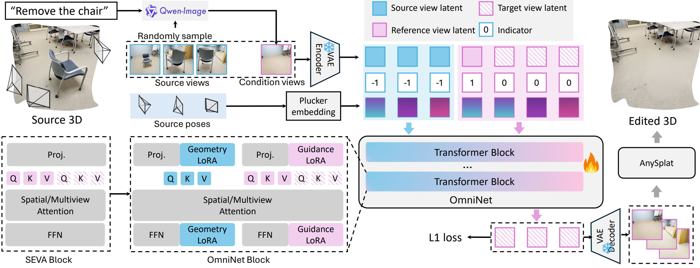

<h2 align="center">Omni-3DEdit: Generalized Versatile 3D Editing in One-Pass</h2>
<h1 align="center" style="font-size: 30px; font-weight: 600;">
  CVPR26 Highlight
</h1>

<p align="center">
  <a href="#">Liyi Chen</a><sup>*</sup>&nbsp;&nbsp;
  <a href="#">Pengfei Wang</a><sup>*</sup>&nbsp;&nbsp;
  <a href="#">Guowen Zhang</a>&nbsp;&nbsp;
  <a href="#">Zhiyuan Ma</a>&nbsp;&nbsp;
  <a href="#">Lei Zhang</a><sup>†</sup>
</p>

<p align="center">
  The Hong Kong Polytechnic University<br>
  <sup>*</sup>Equal contribution&nbsp;&nbsp;<sup>†</sup>Corresponding author
</p>

<p align="center">
  <a href="https://arxiv.org/abs/2603.17841"></a>
  <a href="https://mt-cly.github.io/Omni3DEdit_ProjectPage/"></a>
</p>

## Introduction

**Omni-3DEdit** is a unified, feed-forward model for multi-view consistent 3D editing. Given multi-view source images and a reference edited view, it generates edited novel views across diverse tasks — object removal, addition, and color change — in a single forward pass, without any iterative 3D optimization. Built upon the pre-trained [SEVA](https://github.com/Stability-AI/stable-virtual-camera) model, Omni-3DEdit reduces inference time from tens of minutes to approximately **two minutes**.

<p align="center">
  
</p>

## Installation

```bash
git clone https://github.com/mt-cly/Omni3DEdit.git
cd Omni3DEdit

conda create -n omni3dedit python=3.10 -y
conda activate omni3dedit

pip install -r requirements.txt
```

## Quick Start

### 1. Data Preparation

Organize your data under `demo/add/<scene_name>/` with two folders:
- `source_view/` — original multi-view images of the scene
- `cond_view/` — single-image edited results obtained from image editing models (e.g., QwenImage, GPT-4o, or other closed-source models). The first edited image will be used as the conditioning view by default.

Create a JSON descriptor under `demo/jsons/`. See [demo/jsons/demo_remove_book.json](demo/jsons/demo_remove_book.json) for the format:

```json
{
  "editing_type": "remove",
  "scene_name": "book",
  "num_images": 10,
  "successful_edits": 10,
  "image_pairs": [
    {
      "original_path": "../remove/book/source_view/00030.png",
      "edited_path": "../remove/book/cond_view/00030.png",
      "success": true
    }
  ]
}
```

### 2. Inference

Checkpoints are automatically downloaded from [HuggingFace](https://huggingface.co/mutou0308/Omni3DEdit) on first run when using `demo.sh` for `add` / `remove` / `appearance` (including `color_change`). If you run `main.py` directly, make sure the checkpoint exists locally first. To use a single GPU, set `--nproc_per_node=1` and `CUDA_VISIBLE_DEVICES=0`. Results are saved to `results/`.

**Object Removal**

```bash
CUDA_VISIBLE_DEVICES=0,1 \
USE_FLASH_ATTENTION=1 \
PYTHONPATH=. \
python -u -m torch.distributed.run \
    --nnodes=1 \
    --nproc_per_node=2 \
    --master_addr=localhost \
    --master_port=12346 \
    main.py \
    --base=configs/train/seva_edit_mmdit_remove.yaml \
    --no_date \
    --train=False \
    --debug \
    --resume=checkpoints/omni3dedit_remove.ckpt
```

**Object Addition**

```bash
CUDA_VISIBLE_DEVICES=0,1 \
USE_FLASH_ATTENTION=1 \
PYTHONPATH=. \
python -u -m torch.distributed.run \
    --nnodes=1 \
    --nproc_per_node=2 \
    --master_addr=localhost \
    --master_port=12346 \
    main.py \
    --base=configs/train/seva_edit_mmdit_add.yaml \
    --no_date \
    --train=False \
    --debug \
    --resume=checkpoints/omni3dedit_add.ckpt
```

**Appearance Change**

```bash
CUDA_VISIBLE_DEVICES=0,1 \
USE_FLASH_ATTENTION=1 \
PYTHONPATH=. \
python -u -m torch.distributed.run \
    --nnodes=1 \
    --nproc_per_node=2 \
    --master_addr=localhost \
    --master_port=12346 \
    main.py \
    --base=configs/train/seva_edit_mmdit_appearance.yaml \
    --no_date \
    --train=False \
    --debug \
    --resume=checkpoints/omni3dedit_apperance.ckpt
```

  Small note: we also provide a  uni-trained checkpoint (`checkpoints/omni3dedit_unitrain.ckpt`), but its single-task performance is usually weaker than task-specific checkpoints.

### 3. 3D Reconstruction (Optional)

The edited multi-view images generated by Omni-3DEdit can be converted into 3D Gaussian Splats using [AnySplat](https://github.com/InternRobotics/AnySplat):

- **Direct reconstruction**: Feed the edited multi-view outputs directly into AnySplat for instant 3D Gaussian reconstruction.
- **With post-processing**: Optionally enable post-optimization in AnySplat for higher quality, which typically adds an extra **1–2 minutes**, using relatively fewer input views can reduce artifacts of 3D Gaussians.

## Training

Prepare your training data JSONs following the same format as inference (see [Data Preparation](#1-data-preparation)). Place them under a directory (e.g., `training_data/jsons/`) and update `json_folder` in the config YAML accordingly.

```bash
# Train object removal model with 8 GPUs
CUDA_VISIBLE_DEVICES=0,1,2,3,4,5,6,7 \
USE_FLASH_ATTENTION=1 \
PYTHONPATH=. \
python -u -m torch.distributed.run \
    --nnodes=1 \
    --nproc_per_node=8 \
    --master_addr=localhost \
    --master_port=12346 \
    main.py \
    --base=configs/train/seva_edit_mmdit_remove.yaml \
    --no_date \
    --wandb \
    --name=seva_edit_mmdit_remove
```

Training logs and checkpoints are saved to `logs/`.

## Acknowledgements

This project builds upon:
- [SEVA (Stable Virtual Camera)](https://github.com/Stability-AI/stable-virtual-camera) by Stability AI
- [VGGT](https://huggingface.co/facebook/VGGT-1B) by Meta

## Citation

```bibtex
@article{liyi2026omni,
  title={Omni-3DEdit: Generalized Versatile 3D Editing in One-Pass},
  author={Liyi, Chen and Pengfei, Wang and Guowen, Zhang and Zhiyuan, Ma and Lei, Zhang},
  journal={arXiv preprint arXiv:2603.17841},
  year={2026}
}
```
